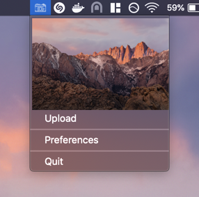
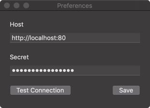

Screenshot Client
========

### About

Screenshot Client written for macOS, to accompany [ScreenshotServer](#).

The client allows a user to upload the last screenshot taken with the native macOS screenshot utility. The path to the uploaded screenshot is automatically copied to the users clipboard.

Preferences
------

Preferences pane to configurate the API connection. Host endpoint must not end with a trailing slash.

License
-------

Project is released under the terms of the MIT License.
